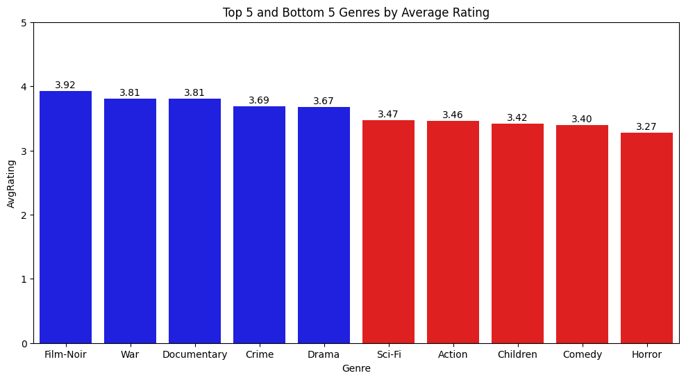
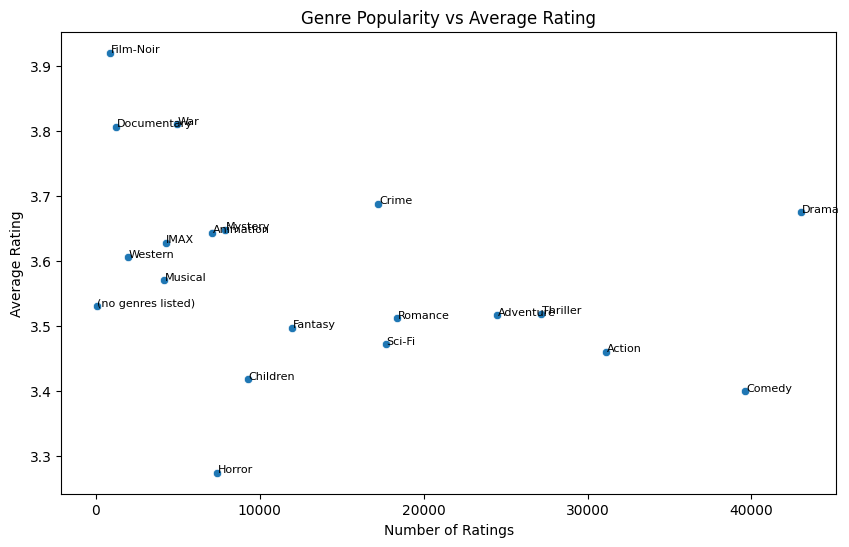
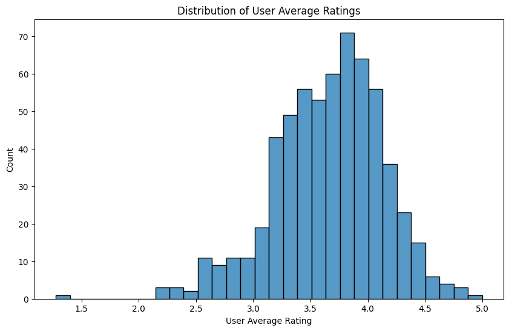
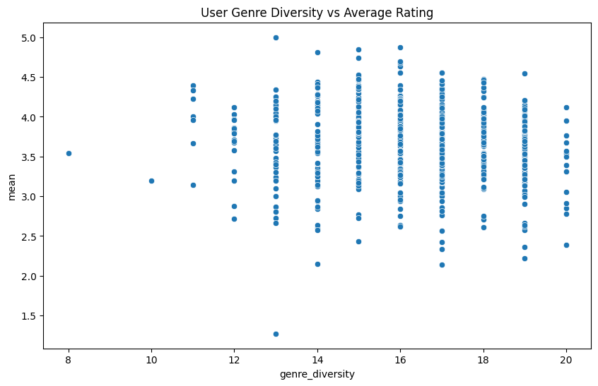
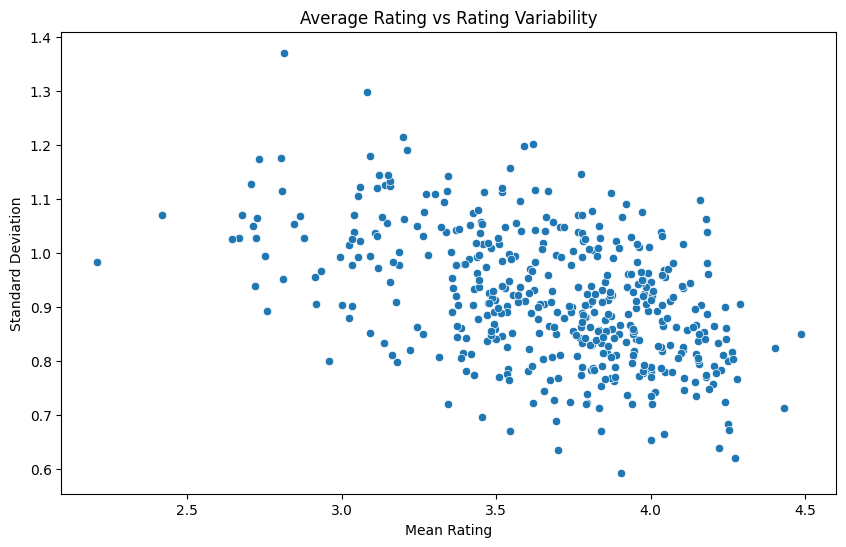
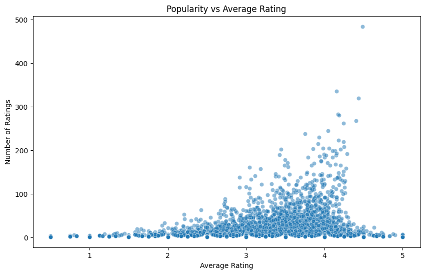
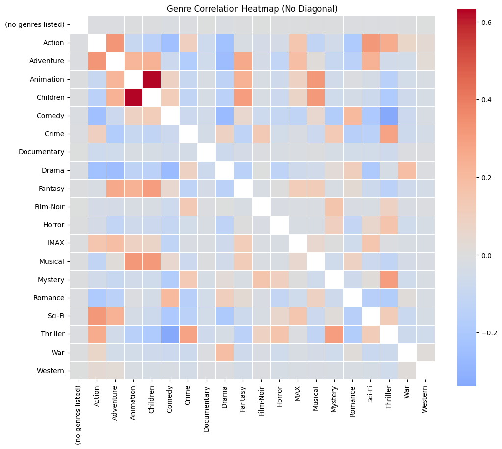
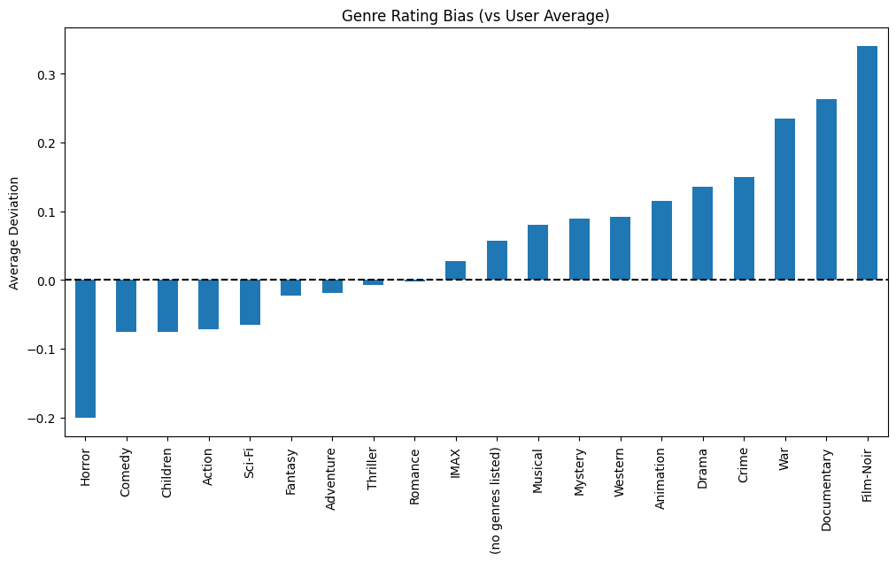

## Dataset Overview

Can we predict what movies someone will like based on what movies they have liked previously? To do this, we will be using the [MovieLens dataset](http://grouplens.org/datasets/) that contains information on movies and what different users thought of them. It contains 4 separate CSV files:

- links.csv - contains keys related to different movie IDs
- movies.csv - contains movie titles and genres
- ratings.csv - contains user ratings of separate movies
- tags.csv - contains user-applied tags on each movie

We will perform most of our analysis on the smaller (100k rows) dataset, but as we move on in the project we may use the 33 million row dataset.

This data is freely available and does not present any legal or ethical challenges (provided we cite them properly). According to their usage license, we are okay to use it for educational purposes.

## Data Description and Preprocessing

As a relational database, this dataset requires lots of joins to extract certain information. With our preprocessing, we ensured that each column was its intended type (i.e. date, numeric, etc.). For the sake of EDA, we merged `movies` and `tags` with the `ratings` table.

Then, we split each genre into lists (as multiple genres are included on each movie). We then generated a list of dummy variables based on which genres applied to each movie.

In the end, our dataframe contained:

- userID
- movieID
- title
- rating (target)
- rating_timestamp
- tag
- tag_timestamp
- genre

## Summary statistics

Overall, our data contains 100836 ratings and 3683 tags across 9742 movies. 

We identified that the top five rated genres of movie (on a scale from 1-5) were:

- Film-Noir (3.92)
- War (3.81)
- Documentary (3.81)
- Crime (3.69)
- Drama (3.67)

Then, the lowest five rated genres of movie were:

- Sci-Fi (3.47)
- Action (3.46)
- Children (3.42)
- Comedy (3.40)
- Horror (3.27)

## Visualizations and interpretations

### The more ratings a genre gets, the lower the average rating goes.

Generally, it appears as though the more ratings a film gets, the lower average rating it tends to receive. Drama is a notable exception, being the most rated genre, and maintaining one of the top average ratings. Film-Noir, on the other hand, has a very high average rating, but very few ratings overall.

This may mean it's safe to assume that someone will enjoy a given Drama movie. Most people probably aren't going to like a Horror movie as much. Crime tends to be decently popular and gets high ratings.

### Users in our data usually rate things between 3-4 stars.

Users most commonly rate things between 3-4 stars, with very few ratings given under 2 stars. 3-4 is by far the most common rating. This is important to be mindful of, as we can't always recommend 5-star movies. Generally, we'd want to avoid recommending 1-star movies, but it looks like there aren't too many of those in our data.

### The Importance of Genre Diversity

Most users had a pretty good amount of genre diversity. Average ratings don't appear to be impacted too much by number of genres watched, so it will probably be important to help users branch out when they use our recommender system.

### Highly rated movies have a lot less variance in ratings.

There's a definite downward trend between the mean rating and variance of ratings on any given movie. The highest rated movies end up getting a lot of 5-star ratings. Interestingly, other than the top movies, the variance appears pretty homoskedastic as we move from lowly to highly-rated movies.

### Popular movies get higher ratings, mostly.

There appears to be a trend between the number of ratings a movie gets and what its overall rating is. So, if we want to suggest a 5-star movie to a user, it's probably safest to go with what most people are already watching. Some of the highest-rated movies don't get a ton of ratings though- we definitely should take the sample size of ratings into account, because we don't want to be skewed towards niche movies that not everyone will like.

### Movie ratings are mostly independent from each other.

The biggest correlations? Children and Animation movies tend to go hand-in-hand with each other, whereas most other genres have less overlap. Overall, these correlations are probably pretty important. Someone that likes Fantasy will likely enjoy an Adventure movie.

### People like War, Documentary, and Film-Noir more than their other average ratings. On the other hand, they don't like Horror.

Users tended to rate Film-Noir movies over 0.3 stars more than movies from any other genre. They tended to rate Horror movies about 0.2 stars less than any other genres. If we're just looking at averages, this is probably helpful to take into consideration.

## Reflection

There's a lot that goes into whether a user enjoys a movie or not. By performing this EDA, we can see the overall trends that may be important to somehow consider in our model. Should we rely on recommending just the most popular movies? We may need to make sure to let our model branch out a little more. If our model underfits, we'll probably see a small set of movies get recommended just because they have favorable ratings among a lot of people. 

This EDA also reveals the great complexity that our task will involve. The Two Towers model we plan on using will help address some of this complexity by limiting the amount of computations involved, but we will probably need to rely on a more complex supervised model.
